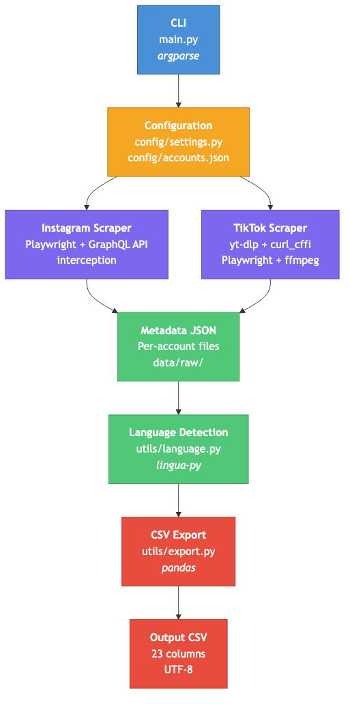

# Summary

Instagram & TikTok Scraper is a Python command-line tool that collects public
post data from Instagram and TikTok for academic research purposes. It
downloads metadata (text, dates, engagement metrics), media files (images,
videos, thumbnails), and post screenshots, then exports a unified CSV dataset
ready for quantitative analysis. The tool uses Playwright [@playwright2024]
for headless browser automation on Instagram and yt-dlp [@ytdlp2024] with
browser impersonation for TikTok, navigating the technical barriers that
platforms impose on programmatic access to publicly available content
[@venturini2019] while incorporating configurable rate limits that avoid
overloading servers. A built-in language detector powered by lingua-py
annotates each post with its ISO 639-1 language code, supporting multilingual
research designs. The entire collection pipeline — from account configuration
to analysis-ready CSV — is driven by a single JSON configuration file and a
command-line interface, making it straightforward to define study samples,
replicate data collection across research teams, and integrate the tool into
larger computational workflows.

# Statement of Need

Computational studies of social media content require structured, reproducible
data pipelines [@chen2024]. While platform-specific APIs exist, they impose
restrictive access policies, limited historical depth, and opaque data filtering
that compromise research transparency [@freelon2018; @bruns2019]. The resulting
"post-API" landscape has left researchers increasingly dependent on ad-hoc
workarounds to access publicly available data that platforms simultaneously make
visible to billions of users but inaccessible to systematic scholarly inquiry
[@tromble2021; @venturini2019].

**Platform API limitations.** Instagram provides no public research API;
access is limited to the Meta Content Library, a controlled virtual environment
where analysis must be conducted within a platform-managed cleanroom, data
cannot be downloaded locally, and researchers are bound by restrictive use
agreements that prohibit linking platform data with external datasets. Although
the Content Library nominally includes posts, Reels, Story highlights, and
carousel albums, an independent audit found that researchers can access only
approximately 50% of Instagram posts visible to users and barely 42% of
available metadata parameters [@bekavac2025]. Access requires institutional
application through the US-based Inter-university Consortium for Political and
Social Research (ICPSR), a process that creates barriers for researchers
without affiliations to eligible institutions. TikTok launched a Research API
available to academics in the United States, the European Economic Area, the
United Kingdom, and Switzerland. However, independent evaluations have revealed
severe shortcomings: access delays of up to 21 months for European researchers,
quotas of only 1,000 requests per day with a maximum of 100 records per
request, a 48-hour indexing delay for new content, and systematic data quality
problems including missing view and share counts for high-profile content and
inconsistent metadata for approximately one in eight videos [@baigu2026].
Furthermore, TikTok's API Terms of Service conflict with established academic
norms by requiring researchers to refresh data every 15 days (deleting prior
copies), prohibiting data sharing with collaborators, and mandating submission
of research papers to TikTok 30 days before publication — conditions that
undermine reproducibility and academic freedom [@trezza2023]. In October 2025,
the European Commission issued preliminary findings that both TikTok and Meta
breached their transparency obligations under Article 40 of the Digital
Services Act regarding researcher data access [@ec2025dsa], further
highlighting the inadequacy of current official channels.

**Ethical considerations.** Web scraping of publicly available data for
academic purposes raises legitimate ethical questions that this tool addresses
by design [@brown2025; @franzke2020]. The tool collects only data that users
have chosen to make publicly visible on open profiles, does not circumvent
authentication or access private content, and implements configurable rate
limits that prevent excessive load on platform servers. These design choices
align with the ethical framework proposed by Brown et al. [-@brown2025], who
argue that the publicness of data, the purpose of collection, and the
minimization of harm — rather than the technical method — should guide ethical
assessment of web scraping for research. The Association of Internet Researchers
similarly recommends context-sensitive evaluation that weighs the social benefit
of the research against potential risks to data subjects [@franzke2020]. In practice, studies using this tool would typically aggregate data at the media-outlet level—analysing publishing patterns and engagement dynamics—rather than focusing on individual user behaviour. Analyses may also include the activity of political actors and other public or institutional subjects, which further reduces potential ethical risks [@fiesler2018].

**Equitable access for the global research community.** The geographic and
institutional restrictions of official APIs create a two-tiered research
landscape. TikTok's Research API is available only to academics in the United
States, the EEA, the United Kingdom, and Switzerland, while the DSA's vetted
researcher framework applies exclusively within EU jurisdiction — leaving
researchers in Latin America, Africa, Asia, and Oceania without a regulatory
pathway to access platform data. Open-source tools such as the one presented
here provide unrestricted access to publicly available data regardless of
geographic location or institutional affiliation, enabling researchers
worldwide to study the local presence of global platforms in their own media
ecosystems.

**Gap in existing tools.** Instagram and TikTok are the two leading visual
social media platforms for journalism and communication research. TikTok has
surpassed X (formerly Twitter) as a weekly news source globally, reaching 13%
of news consumers, while Instagram continues to grow as a channel for visual
news distribution [@newman2024]. Despite their centrality, existing open-source
scrapers typically target a single platform: Instaloader [@instaloader2024]
covers only Instagram, while pyktok [@pyktok2024] handles only TikTok. The
multi-platform toolkit 4CAT [@peeters2022] supports several platforms but
relies on a companion browser extension (Zeeschuimer) for Instagram and TikTok
capture, requiring manual browsing rather than automated collection. None of
these tools combine programmatic scraping of both platforms with integrated
media archiving, unified output schemas, and automatic language detection — a
critical feature for comparative or multilingual studies.

Instagram & TikTok Scraper addresses this gap by offering a single,
configuration-driven tool that:

- scrapes both platforms under a unified schema of 23 variables
  (\autoref{tab:schema}), with platform-specific fields populated where the
  source API provides them,
- archives original media files and rendered screenshots for visual content
  analysis,
- reconstructs TikTok carousel (photo slideshow) posts from individual images
  and audio into playable video files using ffmpeg,
- detects post language automatically, and
- exports a consolidated, analysis-ready CSV dataset.

The tool is designed for the NEXTDIGIMEDIA research project at the Universidade
de Santiago de Compostela and supports data collection for research in
journalism, political communication, and digital media studies.

# Software Design

The architecture follows a modular pipeline pattern (\autoref{fig:arch}),
separating configuration, platform-specific scraping, post-processing, and
export into independent components that can be tested and extended
independently. This design responds to the call for transparent and auditable
data collection tools in computational social science [@freelon2018;
@peeters2022].

1. **Configuration** (`config/settings.py`, `config/accounts.json`): A JSON
   file declares target accounts with platform handles, user-defined
   categories (e.g., broadsheet, tabloid, digital-native), and the study date
   range. Global settings control download options, screenshot capture,
   carousel reconstruction, and rate limiting. This declarative approach
   ensures that study samples are version-controllable and shareable across
   collaborators.

2. **Scrapers** (`scrapers/`): Platform-specific modules implement a common
   interface (`scrape_all_accounts`, `take_screenshots_from_metadata`),
   allowing the CLI to treat both platforms uniformly.
   - `InstagramPlaywrightScraper` uses Playwright to load profiles in headless
     Chromium, intercepts Instagram's GraphQL API responses to extract post
     data, and supports cursor-based pagination for complete timeline
     collection. Configurable delays between requests avoid overloading
     servers.
   - `TikTokScraper` invokes yt-dlp with `curl_cffi` browser impersonation
     to download video metadata and media. For carousel posts (image
     slideshows), it launches Playwright to extract slide image URLs from
     TikTok's server-side rendered data, then uses ffmpeg [@ffmpeg2024] to
     composite slides with audio into a standards-compliant MP4 video file,
     preserving a media format that would otherwise be lost in metadata-only
     collection.

3. **Language Detection** (`utils/language.py`): Each post caption is cleaned
   of URLs, hashtags, and mentions, then passed to lingua-py's statistical
   detector [@lingua2024]. Results are stored as ISO 639-1 codes. This
   preprocessing step removes noise that would otherwise bias n-gram-based
   detection, improving accuracy on the characteristically short texts found
   in social media posts.

4. **Export** (`utils/export.py`): All per-account metadata JSON files are
   consolidated into a single pandas [@pandas2024] DataFrame, sorted by
   category, account, and date, and exported as a UTF-8 CSV file directly
   importable into R, SPSS, or Python analysis environments.
   \autoref{tab:schema} lists the 23 output variables and their availability
   per platform.

: Unified CSV schema. IG = Instagram, TT = TikTok. \* TikTok audio metadata is extracted from the platform's own music catalogue; for user-created "original sounds" without a catalogue match, the field contains the literal string `original sound`. \label{tab:schema}

| # | Variable | Description | IG | TT |
|--:|----------|-------------|:--:|:--:|
| 1 | `category` | Researcher-defined account group | ✓ | ✓ |
| 2 | `account_name` | Display name | ✓ | ✓ |
| 3 | `account_id` | Unique account identifier | ✓ | ✓ |
| 4 | `platform` | Source platform label | ✓ | ✓ |
| 5 | `post_id` | Unique post identifier | ✓ | ✓ |
| 6 | `post_url` | Permalink to the post | ✓ | ✓ |
| 7 | `date` | Publication timestamp (ISO 8601) | ✓ | ✓ |
| 8 | `caption` | Full post text | ✓ | ✓ |
| 9 | `hashtags` | Extracted hashtag list | ✓ | ✓ |
| 10 | `likes` | Like count | ✓ | ✓ |
| 11 | `comments` | Comment count | ✓ | ✓ |
| 12 | `views` | View count | video | ✓ |
| 13 | `shares` | Share/repost count | — | ✓ |
| 14 | `fb_likes` | Facebook cross-post likes | ✓ | — |
| 15 | `format` | Media type (image/video/carousel) | ✓ | ✓ |
| 16 | `duration` | Video duration (seconds) | — | ✓ |
| 17 | `music_title` | Audio track name\* | — | ✓ |
| 18 | `music_author` | Audio track artist\* | — | ✓ |
| 19 | `media_files` | Downloaded media file paths | ✓ | ✓ |
| 20 | `thumbnail` | Thumbnail file path | ✓ | ✓ |
| 21 | `metadata_file` | JSON metadata file path | ✓ | ✓ |
| 22 | `language` | Detected language (ISO 639-1) | ✓ | ✓ |
| 23 | `notes` | Scraper annotations | ✓ | ✓ |

5. **CLI** (`main.py`): A standard argparse interface supports platform
   selection, category filtering, date-range overrides, export triggering, and
   a screenshots-only mode for re-capturing visuals from existing metadata.
   Researchers can thus collect data incrementally or re-export consolidated
   datasets without re-scraping.

# Research Applications

The tool supports several research methodologies common in computational social
science and journalism studies [@chen2024]:

- **Content analysis**: The schema in \autoref{tab:schema} covers post
  metadata, engagement metrics, format classification, and language — mapping
  directly to standard content analysis codebooks used in journalism and
  communication research.
- **Multimodal analysis**: Archived images, videos, and full-page screenshots
  enable visual content analysis alongside textual data, supporting studies
  that examine framing, visual rhetoric, or platform-specific presentation
  formats such as Instagram carousels and TikTok slideshows.
- **Comparative platform studies**: The unified CSV output facilitates
  cross-platform comparison with consistent variable definitions, allowing
  researchers to compare how the same media outlet adapts its content strategy
  across Instagram and TikTok.
- **Longitudinal studies**: Configurable date ranges and category-based
  account grouping support panel and time-series designs, enabling tracking
  of engagement trends and content evolution over weeks or months.
- **Multilingual research**: Automatic language detection enables corpus
  stratification by language, which is particularly useful in multilingual
  media ecosystems such as those found in Spain, Belgium, or Switzerland.

# AI Transparency Statement

Development of this software was assisted by AI tools (GitHub Copilot Pro and
Claude Opus 4.6) for code generation, debugging, and documentation drafting. The author
reviewed, tested, and validated all AI-generated outputs. The software design,
research methodology, and academic decisions are solely the work of the author.

# Acknowledgements

This work is part of the R&D project *Artificial Intelligence in Digital Media
in Spain: Effects and Roles* (PID2024-156034OB-C22), funded by
MICIU/AEI/10.13039/501100011033 and by "ERDF/EU".

# References
